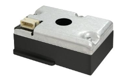

# Arduino-PM1006K

An Arduino driver library to communicate with the Cubic PM1006K particulate matter sensor. This sensor can be commonly found in inexpensive air quality monitors including the Ikea [Vindriktning](https://www.ikea.com/ca/en/p/vindriktning-air-quality-sensor-60515911/).

You can find the data sheet for this sensor [here](https://en.gassensor.com.cn/Product_files/Specifications/LED%20Particle%20Sensor%20PM1006K%20Specification.pdf).

The PM100K uses infrared LEDs and an infrared detector to measure the particulate matter concentrations for 2.5um, 10um, and 1.0um particles in μg/m³. The sensor is designed to be used in conjunction with a fan to draw air through the sensor. 